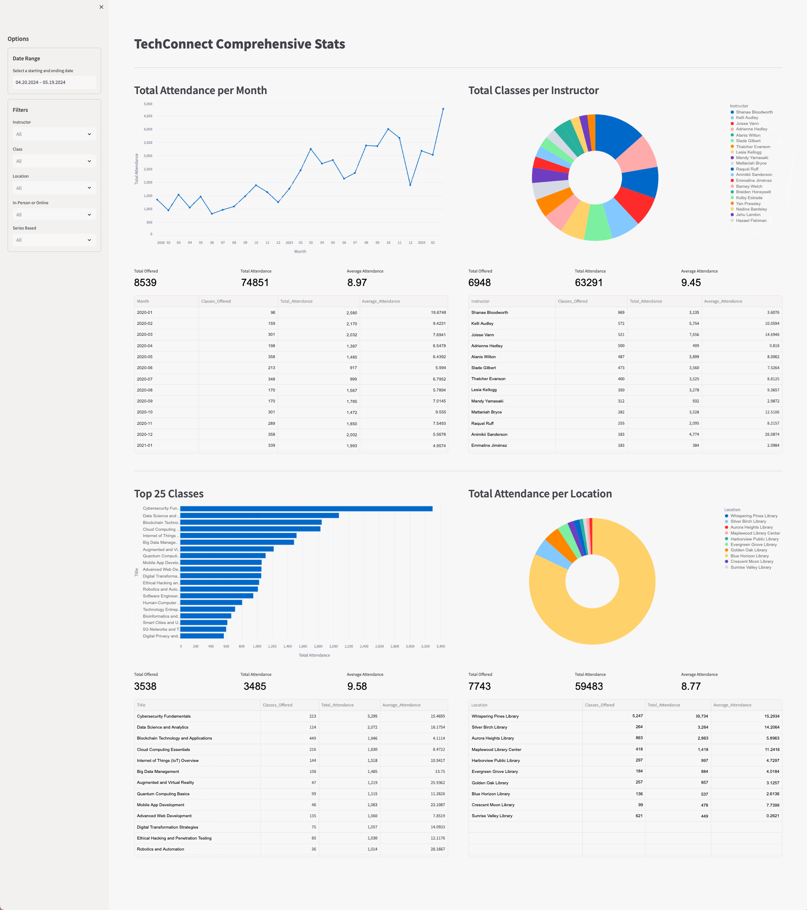
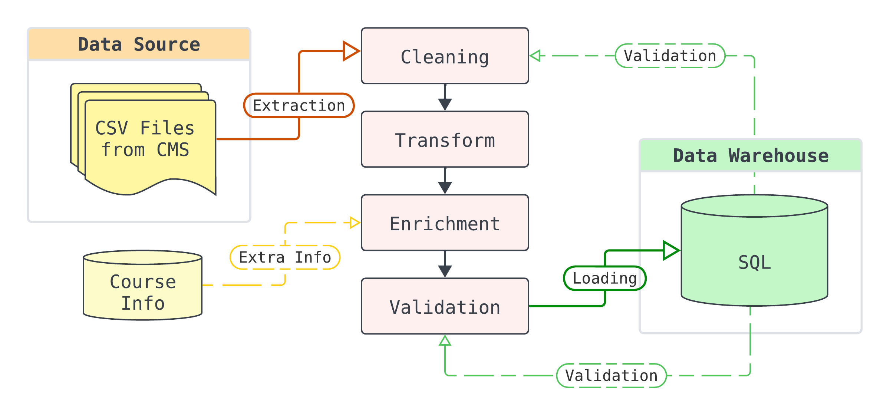
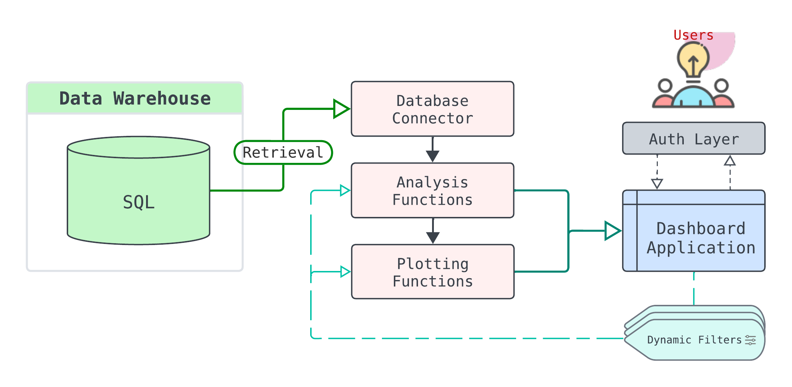

  
  <h1>TechConnect Comprehensive Stat Tracking System</h1>
  
  

    <a href="https://github.com/kchenTTP/team_stat_tracking" style="font-size:1.3em;"><strong>TechConnect Comprehensive Stat Tracking System</strong></a> is the seamless combination of two distinct software components (<a href="https://github.com/kchenTTP/tc_stat_track_data_pipe" style="font-size:1.1em;"><strong>data pipeline</strong></a> and <a href="https://github.com/kchenTTP/tc_stat_track_app" style="font-size:1.1em;"><strong>analysis dashboard</strong></a>) to transform, store, and provide insightful analysis of team-wide attendance statistics. 
  

  
   
  
  

## Map
- [<ins>System Overview</ins>](#1---system-overview)
- [<ins>Data Processing Pipeline</ins>](#2---data-processing-pipeline)
- [<ins>Data Warehouse</ins>](#3---data-warehouse)
- [<ins>Analysis Dashboard</ins>](#4---analysis-dashboard)

## 1 - System Overview
The system consists of a data processing pipeline, an analysis dashboard, and a data warehouse.

  

### [<ins>Data Processing Pipeline</ins>](#2---data-processing-pipeline)
The data processing pipeline takes monthly data from the library internal content management system (CMS) and transforms it to a format suitable for the purpose of the TechConnect team.

### [<ins>Data Warehouse</ins>](#3---data-warehouse)
The data warehouse is designed in a star schema format, encompassing all event data along with team information.

### [<ins>Analysis Dashboard</ins>](#4---analysis-dashboard)
The analysis dashboard retrieves data from the data warehouse and transforms it into various views and charts to facilitate easy analysis and insights.

## 2 - Data Processing Pipeline
For detailed documentation on source code please visit: <a href="https://github.com/kchenTTP/tc_stat_track_data_pipe/blob/main/README.md" style="font-size:1.1em;"><ins><strong>here</strong></ins></a>

  

### Data Extraction
- Download monthly system wide event data from online content management system (CMS)
  - Manually download csv files

### Data Cleaning
- Fix incorrect datatype
- Error Handling
  - Fix CMS data exporting errors
  - Compare warehouse data to handle naming error
- Data imputation
- Handle edge cases

### Data Transformation
- Datetime format conversion
- Handle special characters and different languages
- Sort order

### Data Enrichment
- Add additional columns for missing information from CMS data

### Data Validation
- Validate processed data matches database data
- Test transformation functions performs correctly

### Data Loading
- Store data to remote SQL server using [database connectors](https://github.com/kchenTTP/db-connections)
- Create local backups of database

> *Note:*
> - *Future update: schedule monthly data transformation & database writing & back-up after monthly data has been scraped (Prefect)* [^1]
> - *Future update: More testing* [^4]

## 3 - Data Warehouse
- SQL database (star schema model) updated monthly whenever CMS gets all information from team
  - Events table
  - Team members table

> *Note:*
> - *Future update: Scrape class information from internal Airtable database due to API limitations using [airtable scraper](https://github.com/kchenTTP/airtable-scraper) library* [^2]
> - *Future update: store airtable data in warehouse + scheduled scraping to automate class name adjustments (Prefect)*

## 4 - Analysis Dashboard
For detailed documentation on source code please visit: <a href="https://github.com/kchenTTP/tc_stat_track_app/blob/main/README.md" style="font-size:1.1em;"><ins><strong>here</strong></ins></a>

  

### Database Connector
- Connect to database, retrieve event data, and cache it for smoother user experience

### Analysis Functions
- Aggregate, filter, analyze stats from SQL database

### Plotting Functions
- Plot charts for dashboard to support analysis

### Dashboard Application
- Streamlit interactive dashboard

### Authentication Layer
- Sign-in page and router for Streamlit to block unauthorized users and redirect users who have already signed in

> *Note:*
> - *Future update: Generate data reports*[^3]
> - *Future update: More testing* [^4]

## *Future Features*
[^1]: Due to internal system using multiple versions of CMS (Drupal), the API is unreliable. Web scraping is required to retrieve system data  
[^2]: Scrape class information for more accurate event data  
[^3]: Generate Excel or pdf reports of data dashboard  
[^4]: More testing to ensure data quality and application functionality  
