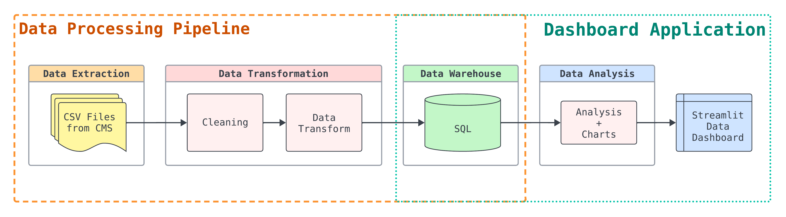

# Stat Tracking System Documentation
High-level overview of [team stat tracking system](https://github.com/kchenTTP/team_stat_tracking.git).

---
## Data Pipeline Diagram & Overview

### **Data Extraction**
- Download monthly system wide event data from online content management system (CSM)
  - Manually download csv files
  - Or, periodically scrape csv files (Google Cloud Functions)[^1]

### **Data Transformation Pipeline**
#### *Data Cleaning (Pandas)*
- Drop unused columns
- Fix incorrect datatypes
- Drop duplicated rows
- Handle CMS data exporting errors
- Data imputation

#### *Airtable Data Extraction (Airtable API)*
- Extract class information from Airtable database

#### *String Matching & Genre Classification*
- Match class title strings from CMS data to Airtable data[^2]
- Class genre classification[^3]

#### *Data Transformation*
- Add columns for additional information missing from CMS data

#### *Data Loading (BigQuery Python API)*
- Load processed data and additional supporting data into BigQuery (star schema model)

### **Data Warehouse**
- BigQuery

### **Data Analysis Pipeline**
#### *Data Transformation (Pandas, Matplotlib)*
- Connect to BigQuery
- Aggregate data
- Plot charts

#### *Dashboard (Streamlit)*
- Streamlit interactive dashboard
- Authentication layer to limit access to team members
- Generate data reports[^4]

---

## *Future Features*
[^1]: Due to CMS API not being available, web scraping is required
[^2]: String matching with fuzzy match or KNN
[^3]: Classify each class to their own genre with KNN & clustering techniques
[^4]: Generate Excel or pdf reports
